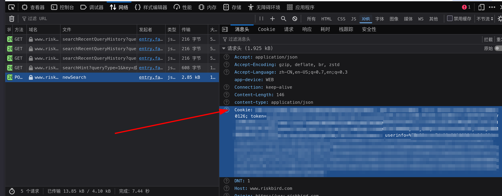
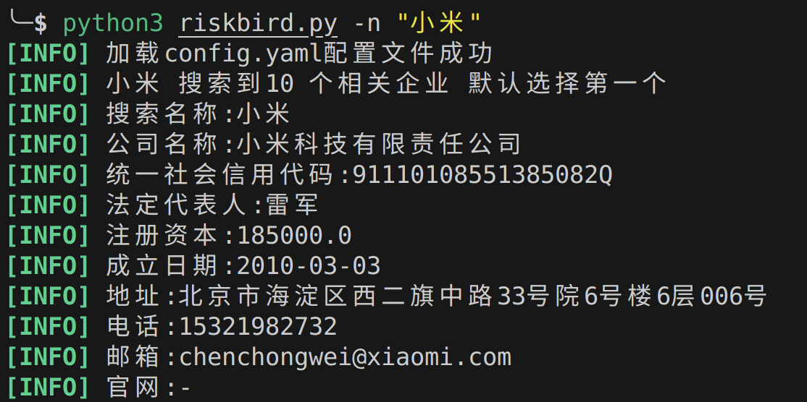
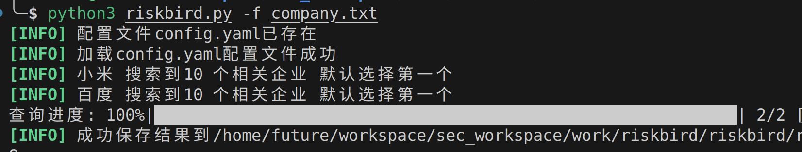

# RiskBird企业信息模糊查询工具

1.本工具仅供学习与交流使用，不得将其用于任何商业或盈利目的。

2.工具提供的内容和功能仅作参考，不保证完全准确、完整或适用于所有场景。

3.使用本工具所产生的风险和后果由用户自行承担，开发者不对因使用或无法使用本工具造成的任何损失承担责任。

4.用户在使用本工具时应遵守相关法律法规，不得利用本工具从事违法或不当行为。

## 1 用法
```
usage: riskbird.py [-h] [-n NAME] [-f FILE] [-c COOKIE] [-m MAX]

RiskBird 公司信息查询工具

options:
  -h, --help            show this help message and exit
  -n NAME, --name NAME  查询单个公司信息
  -f FILE, --file FILE  批量查询公司列表文件
  -c COOKIE, --cookie COOKIE
                        认证 Cookie
  -m MAX, --max MAX     最大并发数 (默认 1)
```

## 2 COOKIE配置

登录风鸟后，查询任意企业，获取cookie



## 3 用法示例

### 3.1 查询企业信息
`python3 riskbird.py -n "小米"` 

### 3.2 批量查询企业信息
`python3 riskbird.py -f company.txt`



